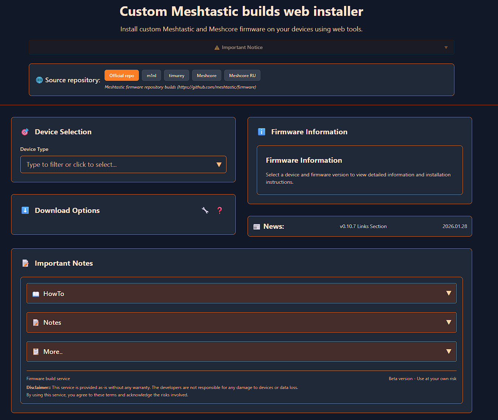

# Meshtastic custom web flasher

Used to serve builded firmwares/make firmwares available for selecting/flashing/downloading.

Deployed at https://mrekin.duckdns.org/flasher/ or https://flashmesh.ru

## License

This project is licensed under the GNU General Public License Version 3 (GPLv3).

See the [LICENSE](LICENSE) file for the complete legal text.

For the full license, visit: https://www.gnu.org/licenses/gpl-3.0.html
